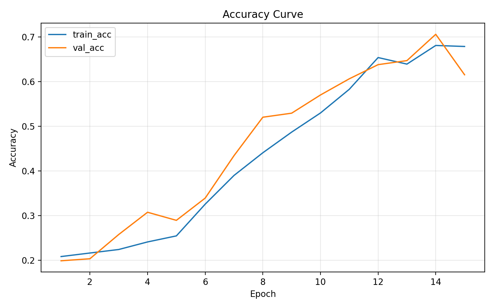
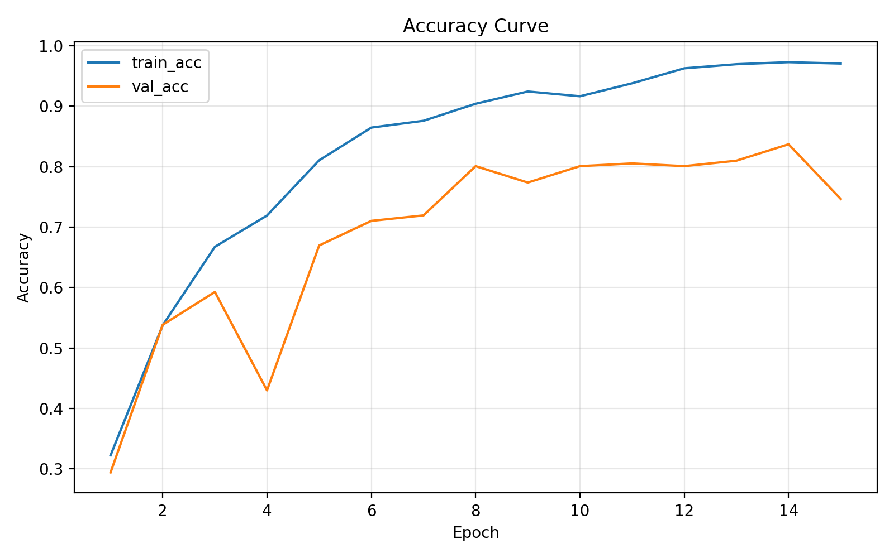
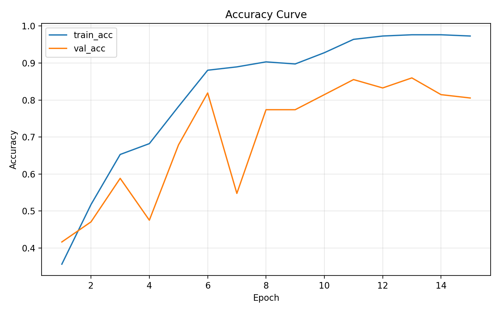
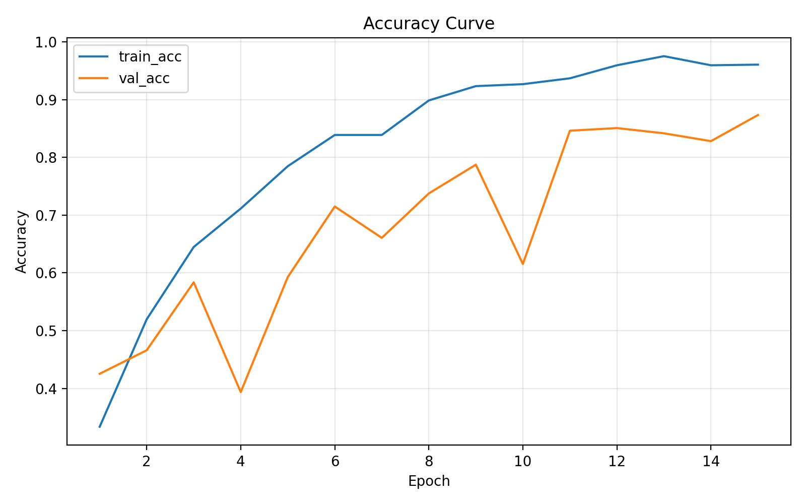
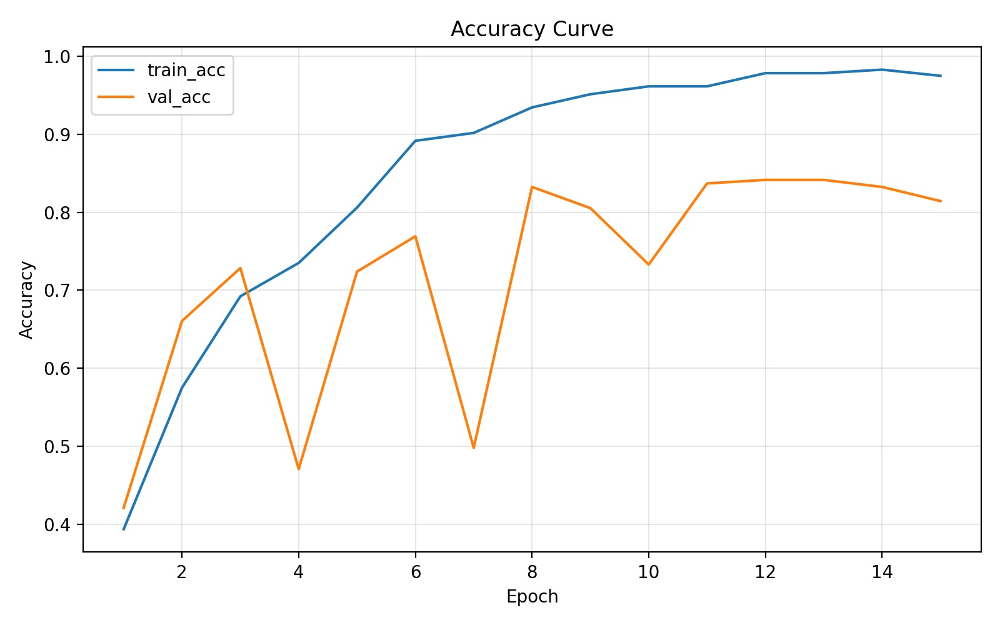

<h1 style="text-align: center;">Deep Learning Task (SpakborMio)</h1>

# ResNet‑34 untuk Klasifikasi Citra
Anggota:
- Rahmat Aldi Nasda (122140077)
- Fathan Andi Kartagama (122140055)
- Dito Rifki Irawan (122140153)

## Pendahuluan

Eksperimen membandingkan Plain‑34, ResNet‑34, dan varian modifikasinya untuk klasifikasi lima kelas. Tujuan utamanya menilai dampak residual connection, pre‑activation, dan SE‑Block terhadap stabilitas pelatihan serta akurasi validasi.

## Arsitektur yang Diuji

* Plain‑34: tanpa skip connection.
* ResNet‑34: dengan skip connection pada tiap blok.
* Pre‑activation ResNet‑34: BN dan ReLU sebelum konvolusi, tanpa aktivasi setelah penjumlahan.
* SE‑ResNet‑34: penambahan Squeeze and Excitation untuk perhatian kanal.
* SE‑Preactivate ResNet‑34: gabungan pre‑activation dan SE‑Block.

## Baseline Hyperparameter

| Parameter     | Value     |
|--------------|-----------|
| epochs       | **15**    |
| batch_size   | **32**    |
| lr           | **1e-4**  |
| val_ratio    | **0.2**   |
| img_size     | **224**   |
| seed         | **42**    |
| workers      | **0**     |
| optimizer    | **AdamW** |
| weight_decay | **1e-4**  |

## Hasil Utama

| Model          | Epoch terbaik | Train Acc | Val Acc |
| -------------- | ------------: | --------: | ------: |
| Plain‑34       |            14 |    68.09% |  70.59% |
| ResNet‑34      |            14 |    97.29% |  83.71% |
| Pre‑activation |            11 |    96.39% |  85.52% |
| SE‑ResNet      |            15 |    96.05% |  87.33% |
| SE‑Preact      |            13 |    97.63% |  85.97% |

### Visualisasi akurasi per model

*Kurva akurasi Plain‑34 pada data validasi.*

*Kurva akurasi ResNet‑34 pada data validasi.*

*Kurva akurasi pre‑activation ResNet‑34 pada data validasi.*

*Kurva akurasi SE‑ResNet‑34 pada data validasi.*

*Kurva akurasi SE‑Preact ResNet‑34 pada data validasi.*

## Poin Kunci

1. Residual connection menjadi penentu. Dibanding Plain‑34, ResNet‑34 meningkatkan akurasi validasi sekitar 13 poin dan menurunkan loss validasi.
2. SE‑Block paling unggul. SE‑ResNet meraih 87.33 persen serta stabil hingga akhir pelatihan, membantu mengurangi overfitting melalui perhatian kanal.
3. Pre‑activation efektif pada pertengahan pelatihan, tetapi pada kedalaman 34 layer keuntungannya tidak konsisten di akhir.
4. Kombinasi SE dan pre‑activation stabil di 85.97 persen, namun masih di bawah SE‑ResNet.
5. Ukuran dataset yang kecil membuat regularisasi penting. SE‑Block bertindak sebagai regularizer alami sehingga performa tetap tinggi saat epoch terakhir.

## Rekomendasi Singkat

Gunakan SE‑ResNet‑34 sebagai pilihan utama pada skala data serupa. Terapkan regularisasi tambahan seperti label smoothing, serta pertimbangkan scheduler Cosine atau One Cycle dan mekanisme early stopping. Sertakan evaluasi per kelas dan confusion matrix untuk identifikasi kelas sulit.

## Kesimpulan

Residual connection terbukti meningkatkan stabilitas dan akurasi validasi. SE‑ResNet‑34 memberikan hasil terbaik dan paling konsisten. Pre‑activation memberi dorongan sementara, tetapi pada kedalaman 34 layer pengaruhnya lebih terbatas dibandingkan perhatian kanal dari SE‑Block.

## Lampiran
Seluruh lampiran tersedia di [Laporan Resnet](./laporan/laporan_resnet34.pdf) dan juga [Grafik Lengkap](./runs/plot/).

<h1 style="text-align: center;"> Terima Kasih! </h1>